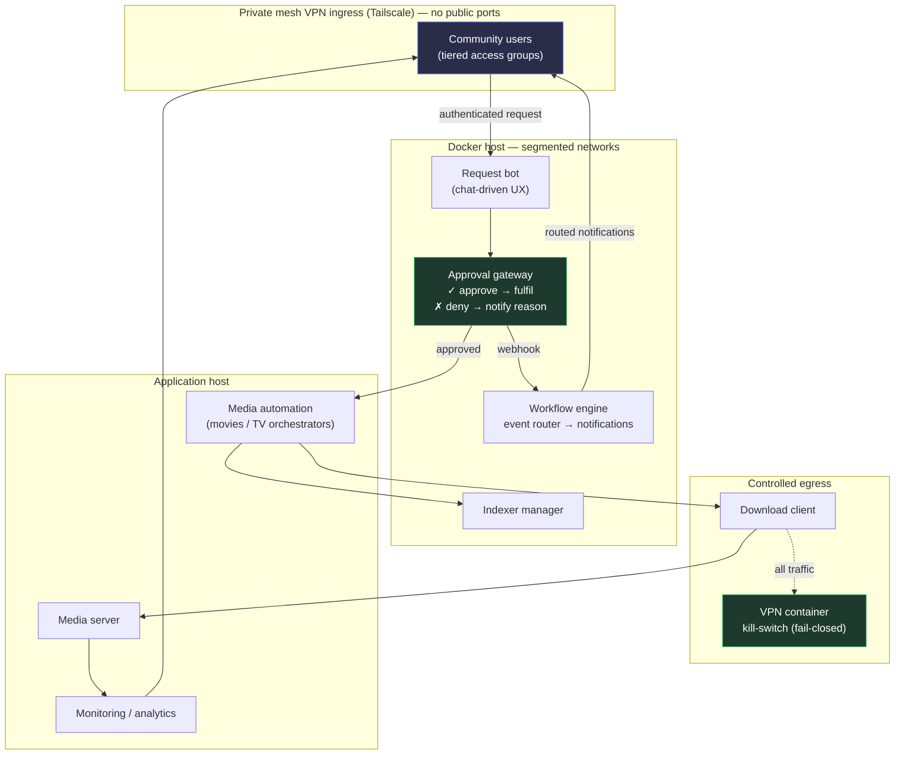

# Secure Self-Hosted Media Home Lab

> A defense-in-depth home lab: an event-driven, fully automated self-hosted service stack designed and operated with a blue-team mindset — network segmentation, least-privilege access, secrets hygiene, controlled egress, and minimised remote-attack surface.

<p align="left">
  
  
  
  
</p>

---

## What this is

This repository documents a real, production home lab I designed, hardened, and operate: a self-hosted media service that lets a small private community request content through Discord, routes those requests through an approval gate, automates fulfilment, and notifies users — **end to end, with no manual admin steps except the approval decision itself.**

I'm a defensive-security (blue team) practitioner, so the interesting part of this project isn't that it streams media — it's **how the infrastructure is secured and operated**. Every architectural choice here was made through a threat-modelling lens. This repo is structured to show that reasoning, not just the end result.

If you're reviewing this as a hiring manager or peer, the two documents worth your time are **[`SECURITY.md`](./SECURITY.md)** (threat model + hardening decisions) and **[`docs/design-decisions.md`](./docs/design-decisions.md)** (the engineering trade-offs, ADR-style).

---

## Security highlights

The transferable engineering, at a glance:

| Control | What I did | Why it matters |
|---|---|---|
| **Network segmentation** | Services split across isolated Docker Compose networks; cross-project traffic uses explicit host LAN routing rather than implicit container links | Limits lateral movement; a compromised container can't freely reach the rest of the stack |
| **Controlled egress** | Download client routed through a VPN container with a **kill-switch** (fail-closed) | No traffic leaks if the tunnel drops — egress is denied by default, not best-effort |
| **Minimised attack surface** | Remote access via a private mesh VPN (Tailscale) instead of port-forwarding | Zero internet-exposed ports; no public listener to scan or brute-force |
| **Least privilege** | Per-service, narrowly-scoped API keys; no shared "god" credentials between components | Blast radius of any single leaked key is contained to one service |
| **Secrets hygiene** | All secrets in `.env` files, never committed; `.env.example` templates only; CI secrets scanning | Repo is safe to make public; leaked-credential class of bug is caught pre-merge |
| **Supply-chain discipline** | Documented rejection of untrusted "free IPTV" / unvetted add-on sources | Avoids a well-known malware and credential-theft vector (see SECURITY.md) |
| **Hardened containers** | Pinned images, least-privilege mounts, no unnecessary capabilities | Reduces the impact of an image or dependency compromise |

---

## Architecture

A request travels through an approval gate before any automation runs. Notification routing is decoupled via a workflow engine so the pipeline is event-driven rather than polled.



> A higher-resolution architecture diagram is in [`docs/architecture.md`](./docs/architecture.md). The **green nodes are the security boundaries** that define the design.

---

## Tech stack

| Layer | Role | Hosting |
|---|---|---|
| Chat request bot | Discord-first request UX | Docker |
| Approval gateway | Human-in-the-loop request gating | Docker |
| Workflow engine (n8n) | Event routing & notification fan-out | Docker |
| Indexer manager | Search-source aggregation | Docker |
| VPN container (gluetun) | Fail-closed egress isolation | Docker |
| Media orchestrators | Acquisition automation | Windows host |
| Media server | Streaming | Windows host |
| Monitoring | Usage analytics & alerting | Windows host |
| Remote access | Tailscale private mesh | Host-level |

The split between containerised and host-native services was a deliberate trade-off — documented in [`docs/design-decisions.md`](./docs/design-decisions.md).

---

## Repository structure

```
.
├── README.md                     ← you are here
├── SECURITY.md                   ← threat model + hardening decisions
├── .github/workflows/
│   └── secrets-scan.yml          ← gitleaks CI (runs on every push/PR)
├── .gitignore                    ← secrets-aware ignore rules
├── .env.example                  ← secrets management template (no real values)
├── docs/
│   ├── architecture.md           ← full diagram + data-flow walkthrough
│   ├── design-decisions.md       ← engineering trade-offs (ADR-style)
│   ├── request-flow.md           ← request lifecycle, approval gating
│   └── user-guide.html           ← community-facing UX (sanitised showcase)
├── docker/
│   ├── n8n/                      ← compose + .env.example
│   ├── gluetun/                  ← VPN kill-switch (the egress control)
│   └── seerr/                    ← approval gateway
└── automation/
    ├── n8n/                      ← workflow notes (exports scrubbed)
    └── powershell/               ← scheduled reporting jobs
```

---

## What I'd point an interviewer to

- **Threat modelling on personal infrastructure** — I treat my home lab like a system I'm responsible for defending, not a toy. See [`SECURITY.md`](./SECURITY.md).
- **Fail-closed egress design** — the VPN kill-switch is a small example of "deny by default" applied to network egress.
- **Reducing attack surface to zero public ports** — choosing mesh VPN over port-forwarding is a defensible-by-design decision.
- **Secrets discipline in a public repo** — `.env.example` templating plus CI secrets scanning, so the repo can be open without leaking anything.
- **Documentation culture** — I keep architecture diagrams and decision records, which is the same hygiene I'd bring to a SOC runbook or detection-engineering repo.

---

## Disclaimer

This is a personal, private-use home lab built for learning and for a small group of trusted users. It is documented here to demonstrate infrastructure-security engineering. Use only legal, licensed content sources and comply with the terms of service and laws applicable in your jurisdiction. Nothing here is intended to facilitate copyright infringement; media-acquisition specifics are deliberately kept generic and out of scope.

## License

[MIT](./LICENSE) — documentation and configuration templates only.
