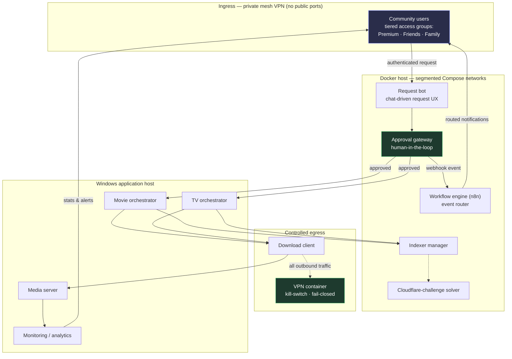

# Architecture

A walkthrough of how a request flows through the stack, and where the security boundaries sit.

## High-level diagram

> **Green nodes are the security boundaries.** The approval gateway is the control-plane boundary (ask vs. do); the VPN container is the egress boundary (fail-closed).

## Data-flow walkthrough

1. **Request.** An authenticated user submits a request through the chat bot. They reach the stack over the private mesh VPN — there is no public endpoint.
2. **Gate.** The request lands at the approval gateway. Nothing downstream runs until a human approves. A denial returns a reason to the user; an approval releases the request to the orchestrators.
3. **Fulfilment.** The movie/TV orchestrators query the indexer manager for sources and hand work to the download client.
4. **Controlled egress.** All of the download client's outbound traffic is forced through the VPN container. If the tunnel is down, traffic is blocked, not leaked.
5. **Delivery.** Completed media lands on the media server.
6. **Notification fan-out.** The gateway emits webhook events; the workflow engine switches on event type and routes notifications to the correct audience group. Monitoring posts usage stats and availability alerts back to users.

## Network boundaries

| Boundary | Enforcement |
|---|---|
| Internet → lab | No inbound ports; mesh VPN only |
| Container → container | Isolated Compose networks; explicit host routing for cross-project calls |
| Download client → internet | Forced through fail-closed VPN container |
| User → control plane | Request-only; approval gate before any action |

## Sanitisation note

Every host address, token, webhook URL, username, and credential has been removed from this repository. Configuration files ship as `.env.example` templates with placeholder values only. Internal addresses are shown as `<HOST_LAN_IP>` placeholders. See [`SECURITY.md`](../SECURITY.md) §C2.
