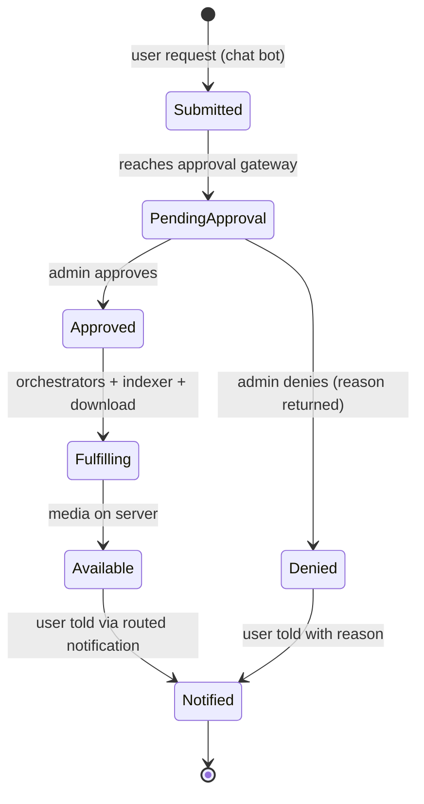

# Request Lifecycle

How a single request moves from "user types a command" to "media is available," and where control is enforced.

## States

## Why the gate exists

The **PendingApproval → Approved** transition is the only manual step in the pipeline, and that is deliberate. It is the boundary between an *outside request* and a *privileged action* that consumes bandwidth, storage, and compute. Automating it away would remove the one human judgment that keeps the control plane out of users' hands. See [`docs/design-decisions.md`](./design-decisions.md) ADR-006.

## Notification routing

Events are emitted as webhooks and routed by a workflow engine that switches on event type, so each audience group only hears what's relevant to it. Adding or changing a notification path is a workflow edit rather than a code change across services. Payloads are validated by type before routing, so malformed events are dropped.

## Tiered access

Users belong to access tiers (Premium / Friends / Family). Tiering is an authorisation concept here — it shapes what each group can request and which notifications they receive — layered on top of the hard approval gate, not a replacement for it.
